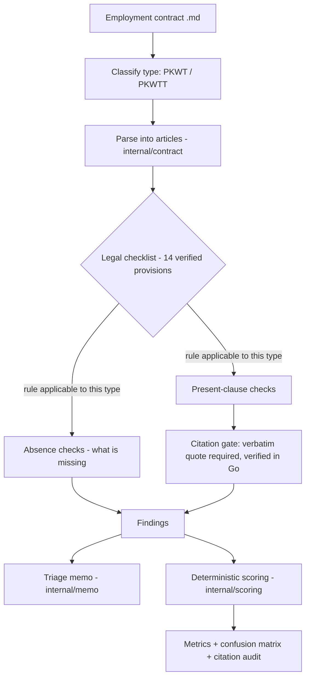

# Architecture

Saksama is a hand-written Go agent loop (no orchestration framework) with a strict
split between **LLM-dependent** stages and a **deterministic** evaluation/scoring
layer.

## Pipeline

## Story, end to end

Problem (a fresh graduate must judge a contract with no lawyer) → agentic workflow
(baseline → S1–S5) → detection (present clauses) → **rule applicability** (PKWT-only
provisions are not applied to a PKWTT contract; PP35-27-5 fires only on a genuine
overtime waiver) → **absence detection** (an explicit pass asks what mandatory
protection is missing) → **evidence / citation gating** (every clause finding must
quote the contract verbatim, verified in Go) → **deterministic scoring** → evaluation
(metrics, confusion matrix, citation audit, failure modes).

## Package boundaries (frozen for submission)

| Package / command | Responsibility | LLM? |
|---|---|---|
| `cmd/baseline` | Run S0 baseline over the corpus | via internal/agent |
| `cmd/solution` | Run S1–S5; render memos | via internal/agent |
| `cmd/eval` | Score, comparison table, confusion matrix, citation audit | **no** |
| `cmd/trajectory` | Export Claude Code sessions to markdown | no |
| `internal/llm` | Hand-written OpenAI/OpenRouter Chat Completions client (net/http, retries) | yes |
| `internal/agent` | Baseline + staged reviewers, prompts, trajectory | yes |
| `internal/contract` | Article (Pasal) splitting, verbatim-quote matching | no |
| `internal/statutes` | Load + validate the 14-provision corpus | no |
| `internal/scoring` | Deterministic matching, metrics, confusion matrix, citation audit | **no** |
| `internal/memo` | Render the Indonesian triage memo from findings | no |

## Determinism boundary

- **LLM-dependent (non-deterministic even at temperature 0):** `internal/llm`,
  `internal/agent`. These produce `results/s*.json` and `trajectories/`.
- **Deterministic:** `internal/scoring`, `internal/contract`, `internal/statutes`,
  `internal/memo`, and `cmd/eval`. Given the committed `results/*.json`, the metrics,
  confusion matrix, citation audit, comparison table, and memos are byte-for-byte
  reproducible with no API key. Verified: two `cmd/eval` runs produce identical
  `results/comparison.md` and `results/audit.md` hashes.

This separation is why judges can verify every committed number with `make eval`
(or `go run ./cmd/eval`) and no network access.
